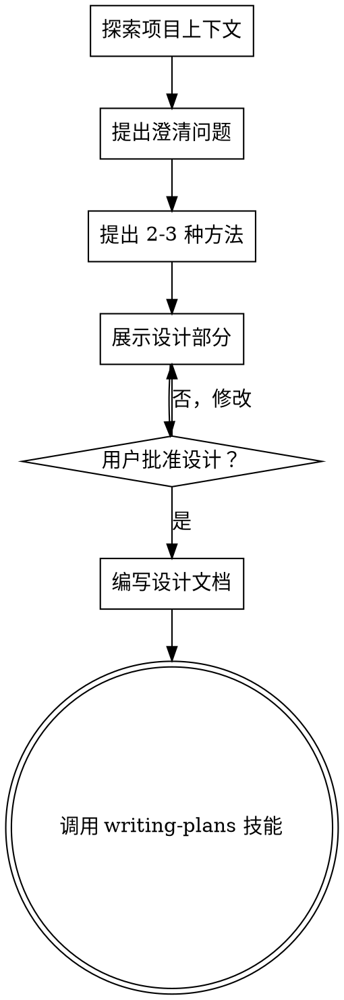

# Brainstorming Ideas Into Designs

## 概述

通过自然的协作对话，将想法转化为完整的设计和规范。

首先了解当前项目上下文，然后一次问一个问题来细化想法。一旦你理解了要构建什么，展示设计并获得用户批准。

<HARD-GATE>
在展示设计并获得用户批准之前，**不要**调用任何实现技能、编写任何代码、搭建任何项目或采取任何实现行动。这适用于**每个**项目，无论看起来多么简单。
</HARD-GATE>

## 反模式："这太简单了，不需要设计"

每个项目都要经过这个过程。待办事项列表、单函数工具、配置更改——所有这些。"简单"项目是未经检查的假设导致最多浪费工作的地方。设计可以很短（对于真正简单的项目只需几句话），但你**必须**展示它并获得批准。

## 检查清单

你**必须**为这些项目中的每一个创建任务并按顺序完成：

1. **探索项目上下文** — 检查文件、文档、最近的提交
2. **提出澄清问题** — 一次一个，理解目的/约束/成功标准
3. **提出 2-3 种方法** — 包含权衡和你的推荐
4. **展示设计** — 按复杂性缩放的部分，每部分后获得用户批准
5. **编写设计文档** — 保存到 `docs/plans/YYYY-MM-DD-<topic>-design.md` 并提交
6. **过渡到实施** — 调用 writing-plans 技能创建实施计划

## 流程图



**最终状态是调用 writing-plans。** 不要调用 frontend-design、mcp-builder 或任何其他实现技能。在 brainstorming 之后调用的唯一技能是 writing-plans。

## 流程说明

**理解想法：**
- 首先检查当前项目状态（文件、文档、最近的提交）
- 一次问一个问题来细化想法
- 尽可能偏好多选题，但开放式问题也可以
- 每条消息只问一个问题 —— 如果一个主题需要更多探索，将其分解为多个问题
- 专注于理解：目的、约束、成功标准

**探索方法：**
- 提出 2-3 种不同的方法及其权衡
- 以对话方式展示选项，并提供你的推荐和理由
- 首先展示你的推荐选项并解释原因

**展示设计：**
- 一旦你相信自己理解了要构建什么，展示设计
- 将每个部分缩放到其复杂性：如果直接，用几句话；如果有细微差别，最多 200-300 字
- 每部分后询问它到目前为止看起来是否正确
- 涵盖：架构、组件、数据流、错误处理、测试
- 如果有什么不合理，准备好回去澄清

## 设计之后

**文档化：**
- 将验证后的设计写入 `docs/plans/YYYY-MM-DD-<topic>-design.md`
- 如果可用，使用 elements-of-style:writing-clearly-and-concisely 技能
- 将设计文档提交到 git

**实施：**
- 调用 writing-plans 技能创建详细的实施计划
- **不要**调用任何其他技能。writing-plans 是下一步。

## 关键原则

- **一次一个问题** — 不要用多个问题压倒用户
- **偏好多选题** — 尽可能时比开放式问题更容易回答
- **无情地应用 YAGNI** — 从所有设计中移除不必要的功能
- **探索替代方案** — 在确定之前总是提出 2-3 种方法
- **增量验证** — 展示设计，在继续之前获得批准
- **灵活** — 如果有什么不合理，回去澄清

## iFlow CLI 特定说明

### 工具调用

此技能使用以下 iFlow CLI 工具：

- `read_file` — 探索项目上下文（文件、文档、最近的提交）
- `write_file` — 编写设计文档
- `run_shell_command` — 提交设计文档到 git
- `Skill` — 调用 writing-plans 技能

### Git 命令

在 Windows 上提交设计文档时，使用以下 PowerShell 命令：

```powershell
git add "docs/plans/YYYY-MM-DD-<topic>-design.md"
git commit -m "docs: add <topic> design"
```

或者使用 Git Bash：

```bash
git add "docs/plans/YYYY-MM-DD-<topic>-design.md"
git commit -m "docs: add <topic> design"
```

### 流程图说明

此技能使用 GraphViz DOT 格式的流程图。如果您的环境不支持图形渲染，流程如下：

1. 探索项目上下文
2. 提出澄清问题
3. 提出 2-3 种方法
4. 展示设计部分
5. 用户批准设计？
   - 否：回到第 4 步，修改设计
   - 是：继续
6. 编写设计文档
7. 调用 writing-plans 技能

## 示例

### 简单示例：添加新按钮

**用户**："我想在首页添加一个新按钮"

**AI**：
1. 使用 `read_file` 检查当前首页文件
2. 询问："这个按钮应该做什么？"
3. 用户："它应该链接到关于页面"
4. 询问："按钮应该放在页面的什么位置？"
5. 用户："导航栏的右侧"
6. 提出 2 种方法：
   - 方法 1：使用现有的按钮组件（推荐）
   - 方法 2：创建新的自定义按钮组件
7. 展示设计：
   - 组件：使用现有的 Button 组件
   - 位置：导航栏右侧
   - 样式：与其他按钮一致
   - 链接：/about
8. 用户批准
9. 编写设计文档
10. 调用 writing-plans 技能

### 复杂示例：实现用户认证系统

**用户**："我想添加用户认证系统"

**AI**：
1. 使用 `read_file` 检查当前项目结构
2. 询问："你希望支持哪些认证方法？"
3. 用户："电子邮件/密码和社交登录"
4. 询问："你需要哪些社交登录提供商？"
5. 用户："Google 和 GitHub"
6. 询问："你需要在服务器端存储用户数据吗？"
7. 用户："是的，我们需要管理用户配置文件"
8. 提出 3 种方法：
   - 方法 1：使用 Firebase Authentication（推荐）
   - 方法 2：使用 NextAuth.js
   - 方法 3：从头构建自定义认证系统
9. 展示设计（分多个部分）：
   - 架构：使用 Firebase
   - 组件：登录页面、注册页面、密码重置页面
   - 数据流：Firebase → 用户状态 → 应用
   - 错误处理：验证错误、网络错误
   - 测试：单元测试、集成测试
10. 每部分后获得用户批准
11. 编写设计文档
12. 调用 writing-plans 技能

## 常见问题

### Q: 这个技能需要多长时间？

A: 取决于项目的复杂性。对于简单项目，可能只需要 5-10 分钟。对于复杂项目，可能需要 30-60 分钟。

### Q: 我可以跳过设计文档吗？

A: 不可以。HARD-GATE 要求你必须编写设计文档并获得用户批准才能进行实现。

### Q: 如果用户拒绝我的设计怎么办？

A: 回到"展示设计"步骤，根据用户的反馈修改设计，然后再次展示。

### Q: 我可以在设计过程中写代码吗？

A: 不可以。在获得用户批准之前，你**必须**不编写任何代码。

### Q: writing-plans 技能可用吗？

A: writing-plans 技能应该已经移植到 iFlow CLI。如果不可用，请先移植该技能。